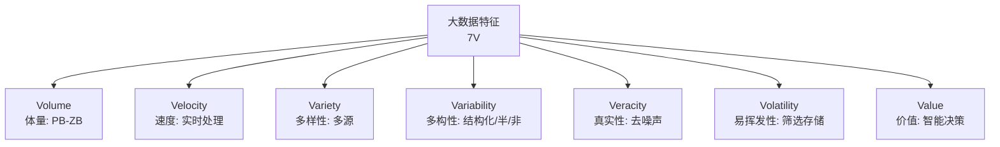
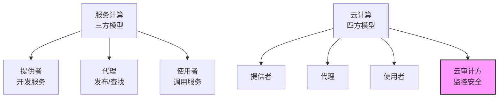
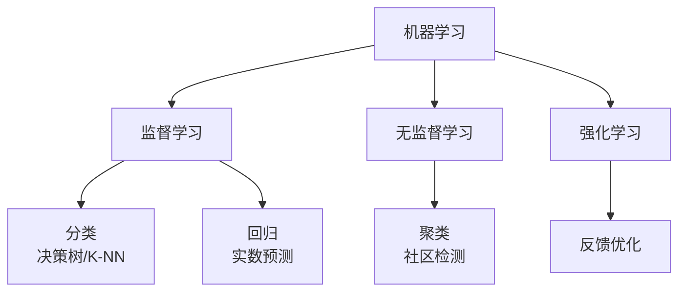
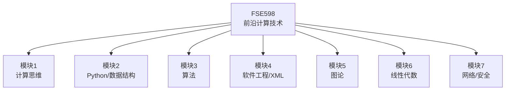
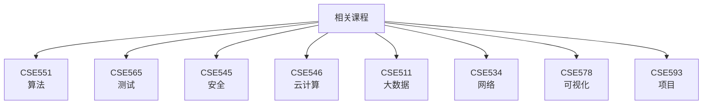

**课程概览**：
- **课程**：FSE598 前沿计算技术，7个模块，针对专业人士（含非计算机背景）。
- **目标**：
  1. 介绍前沿技术（大数据、人工智能、云计算等）。
  2. 为非计算机专业学生补基础，准备后续课程。
- **模块1**：计算思维，单元1为计算机系统设计介绍。
- **前置要求**：学过一门编程语言。

**核心内容**：

1. **前沿技术发展路径**：

```note
互联网+：增强智能=》实体人工智能=》数字人工智能=》大数据=》云计算=》服务与Web计算=》互联网；
        =》物联网（工业控制系统、ADS/DPWS/RaaS 等、工业互联网）=》物联网设备；
应用领域：IT（电信|钟表|汽车|交通|金融|商业|电子），美国经济 75% 增长
```
   - **互联网基础**：
     - 服务计算 与 Web计算：将互联网转为计算平台，面向服务计算，三方模型（提供者、代理中介、使用者）。注意使用者（比如应用程序）跟最终用户非同一概念
     - 云计算：服务计算扩展，提供“无限”计算能力，基于四方模型（新增云审计方）。
     - 物联网：互联网向实体系统延伸（如工业控制、机器人即服务）。
   - **大数据与人工智能**：
     - 云计算支持大数据处理，开启数字人工智能（AI）时代。
     - 数字AI → 实体AI（如机器人） → 增强智能（部分超越人类智能）。
```
5 Layer？
面向服务的计算与基于 web 的计算
虚拟化
数据库、数据中心和数据仓库
超级计算系统(向上扩展)
并行、分布式、网格计算(向外扩展)
```
2. **大数据特征与价值**：
   - **特征（7个V）**：
     - **体量（Volume）**：数据量大（10^15-10^21字节）。
     - **速度（Velocity）**：快速生成与实时处理（如监控找小孩）。
     - **多样性（Variety）**：多源数据（非单一数据库）。
     - **多构性（Variability）**：结构化（数据库）、半结构化（XML）、非结构化（图片、视频）。
     - **真实性（Veracity）**：消除噪声，确保准确性（如数据挖矿）。
     - **易挥发性（Volatility）**：筛选存储，删除不重要数据。
     - **价值（Value）**：高价值，支持智能决策（公司免费服务为获取数据）。
   - **处理流程**：收集 → 建模 → 存储管理 → 分析 → 整合 → 可视化 → 决策。
```
【讲义中：数据收集=》预处理=》建模与组织（分类）=》整合（本体）=》处理=》可视化=》决策】
数据收集=》建模与解析=》与应用整合和角色=》数据存储管理
```
3. **服务计算与云计算**：
   - **服务计算三方模型**：
     - **提供者**：开发服务（如航空公司机票服务），用面向对象编程。
     - **代理**：发布与查找服务（如API中介，类似电话黄页）。
     - **使用者**：调用服务开发应用，供最终用户使用（带图形界面）。
     - **应用**：如携程，动态调用航空、酒店、银行服务，需可编辑文本支持动态更新。
   - **云计算四方模型**：
     - 扩展三方模型，新增**云审计方**（监控服务质量与安全）。
     - 比喻：独立房（传统服务器，自管）vs.公寓（云计算，共享资源、可扩展）。
     - 特点：虚拟化（隐藏物理服务器）、数据中心驱动、成本低、扩展性强。
     - 趋势：取代单独服务器（如ASU取消自有服务器）。

4. **人工智能与机器学习**：
   - **AI分支**：机器学习、专家系统、自然语言处理、视觉、认知、知识表达。
   - **机器学习类型**：
     - **监督学习**：
       - 分类：离散属性（如决策树、K-NN、神经网络）。
       - 回归：连续实数预测（如房价、降雨量）。
     - **无监督学习**：聚类，基于相似性分组（如社交网络社区）。
     - **强化学习**：动态反馈优化模型。
   - **应用**：数据挖掘、机器人、自动驾驶等。

5. **课程与学位项目**：
   - **FSE598定位**：推荐首修课，尤其为非计算机专业学生设计，包含新内容。
   - **模块**：
     - 1：计算思维（可视化编程，如机器学习、机器人）。
     - 2：Python、数据结构、面向对象/服务编程。
     - 3：算法与数据结构（与CSE551互补）。
     - 4：软件工程、XML整合。
     - 5：图论（邓老师）。
     - 6：线性代数（为机器学习准备，邓老师）。
     - 7：网络通信与安全（邓老师）。
   - **相关课程**：
     - **CSE551**：算法设计、复杂性、图算法。
     - **CSE565**：软件测试、正确性。
     - **CSE545**：软件安全。
     - **CSE546**：云计算、虚拟化。
     - **CSE511**：大数据处理、NoSQL。
     - **CSE534**：高级网络、数据中心。
     - **CSE578**：数据可视化。
     - **CSE593**：应用项目或作品集（作品集不算课程）。
     - **CSE571**：AI (好像是新开或者说 FSE.598 未提借）
   - **跨学科**：FSE501（科技创新）或TGM598（决策科学）为必修。

**备考记忆要点**：
- **大数据**：7个V特征（体量、速度、多样性、多构性、真实性、易挥发性、价值），处理流程（收集到决策）。

- **服务计算**：三方模型（提供者、代理、使用者），动态应用（如携程）。

- **云计算**：四方模型（+审计方），虚拟化、扩展性，取代传统服务器。

- **机器学习**：监督（分类、回归）、无监督（聚类）、强化学习。

- **课程**：FSE598为首修，7模块，配合CSE551、565等，跨学科必修FSE501/TGM598。


- **术语**：计算思维、Web计算、虚拟化、XML、算法、数据可视化。

**测试提示**：
- 重点：大数据特征、服务计算与云计算、机器学习。
- 例子：携程动态调用服务、公寓比喻云计算、监控小孩实时处理。


